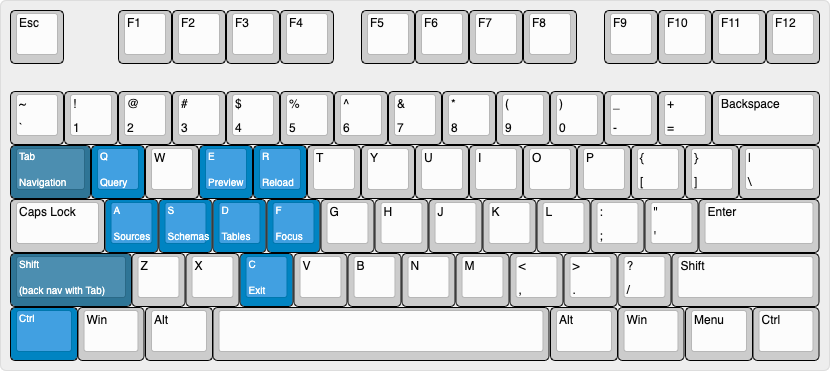

# 🗄 DBUI: Database CLI

**dbui** is database CLI for MySQL and PostgreSQL. It is the terminal user interface application built
with the [tview](https://github.com/rivo/tview).

[](https://github.com/KenanBek/dbui/releases/latest)
[](https://github.com/KenanBek/dbui/actions/workflows/build.yml)
[](https://goreportcard.com/report/github.com/kenanbek/dbui)
[](https://app.codecov.io/gh/KenanBek/dbui/)


**dbui** provides features like,

- Connect to multiple data sources and instances.
- List all schemas in a selected data source.
- List all tables in a selected schema.
- Preview a selected table.
- Execute custom SQL queries on a selected table or schema.
- User-friendly UI features like,
    - query execution status,
    - warning and error messages,
    - full-screen and focus modes,
    - mouse support.

Runs on Mac, Linux, and [Windows](https://kenanbek.gitbook.io/dbui/additional/windows).

##### Linux

`dbui` is available as downloadable binaries from the [releases](https://github.com/kenanbek/dbui/releases/latest) page.
Download the `.deb` or `.rpm` from the [releases](https://github.com/kenanbek/dbui/releases/latest) page and install
with `sudo dpkg -i` and `sudo rpm -i` respectively.

#### Currently supported databases

- MySQL
- PostgreSQL
- SQLite

#### What's next?

- Auto-generate SQL Queries for Insert, Update, Delete.
- Save frequently used SQL Queries.
- Configurable keyboard layout.
- Autocomplete for SQL Queries.

#### Current status

- 🚧 Under development, expect bugs, errors, and unexpected crashes.
- 🐞 Bug and error report very well appreciated.
- 📣 I highly recommend to check for periodic updates.

##### Known Issues

- ❗️Critically low amount of tests.
- ⚠️Having multiple connections and many queries triggers a high CPU load. Now
  when [this PR](https://github.com/KenanBek/dbui/pull/28) merged, as a next step, I will work on profiling the
  application.

## Demo

### Install

```shell script
brew tap kenanbek/dbui https://github.com/kenanbek/dbui
brew install dbui
```

Other [installation options](#install). If you have installed the first versions of `dbui`, you might need to un-tap the
old cask URL. Check [this][wiki-brew-untap] for more information.

### Demo with in-memory dataset

You can run `dbui` with a demo data source.

```shell script
dbui -demo
```

This command will open `dbui` with two dummy data sources, and you can navigate through the demo dataset.

To test it with a real database, you can use the following steps.

### Demo with Docker containers

#### Step 1. Run demo databases

```shell script
docker run -d --name dbui-mysql-demo -p 3316:3306 -e MYSQL_ROOT_PASSWORD=demo genschsa/mysql-employees
docker run -d --name dbui-postgresql-demo -p 5432:5432 ghusta/postgres-world-db:2.4-alpine
```

#### Step 2. Create dbui.yml configuration file

Create `dbui.yml` file in the current folder with the following content:

```shell script
dataSources:
  - alias: employees
    type: mysql
    dsn: "root:demo@(localhost:3316)/employees"
  - alias: world-db
    type: postgresql
    dsn: "user=world password=world123 host=localhost port=5432 dbname=world-db sslmode=disable"
  - alias: chinook
    type: sqlite
    dsn: "internal/sqlite/testdata/chinook.db"
defaut: employees
```

More about [configuration files](#configuration).

#### Step 3. Start dbui

```shell script
dbui
```

## Table of Contents

- [Usage](#usage)
    - [Install](#install)
        - [Brew](#option-1-brew)
        - [Go Install](#option-2-go-install)
        - [Source Code](#option-3-source-code-demo-databases)
    - [Configuration](#configuration)
        - [Configuration Order](#configuration-order)
    - [Keyboard Layout](#default-keyboard-layout)
        - [Focus Hot Keys](#focus-hot-keys)
        - [Special](#special)
        - [Tables Specific](#table-specific)
- [Contribution](#contribution)

## Usage

### Install

#### Option 1: Brew

```shell script
brew tap kenanbek/dbui https://github.com/kenanbek/dbui
brew install dbui
```

If you have installed the first versions of `dbui`, you might need to un-tap the old cask URL.
Check [this][wiki-brew-untap] for more information.

#### Option 2: Go Install

```shell script
go install github.com/kenanbek/dbui@latest
```

#### Option 3: Source Code (+demo databases)

```shell script
git clone https://github.com/KenanBek/dbui.git
cd dbui
make demodbs # runs docker containers with mysql and postgresql demo dbs

# you can destroy them by executing
make demodbs/destroy
```

Copy configuration and run:

```shell script
touch dbui.yml # check below for the content
make run
```

Copy/paste the configuration provided below for demo databases.

### Configuration

By default `dbui` uses configuration file (`dbui.yml`).

```yaml
dataSources:
  - alias: employees
    type: mysql
    dsn: "root:demo@(localhost:3316)/employees"
  - alias: world-db
    type: postgresql
    dsn: "user=world password=world123 host=localhost port=5432 dbname=world-db sslmode=disable"
defaut: employees
```

First, it checks in the current directory, then in the user's home directory.

All provided database connections will be available in the application, and you can switch among them without restarting
the application.

Alternatively, it is possible to start `dbui` for a single database connection using a DSN (data source name) and type
arguments.

```shell
$ dbui -dsn <connection string> -type <data source type>

# example for a mysql connection
$ dbui -dsn "codekn:codekn@(localhost:3306)/codekn_omni" -type mysql
```

#### Configuration Order

```shell
# when
$ dbui
# read from `./dbui.yml` if not then from `~/dbui.yml`

# when
$ dbui -f /my/custom/dir/mydbui.yml
# read from custom directory `/my/custom/dir/mydbui.yml`

# when
$ dbui -dsn "<connection-string>" -type mysql
# init single connection mode
```

### Default Keyboard Layout



#### Focus Hot Keys

- `Ctrl-A` - sources
- `Ctrl-S` - schemas
- `Ctrl-D` - tables
- `Ctrl-E` - preview
- `Ctrl-Q` - query

#### Special

- `Tab` - navigate to the next element
- `Shift-Tab` - navigate to the prev element
- `Ctrl-F` - toggle focus-mode
- `Ctrl-C` - exit

#### Table Specific

Use these keys when the tables panel is active:

- `e` - describe selected table
- `p` - preview selected table (works as ENTER but does not change focus)

#### Preview Specific

Use these keys when the data preview panel is active:

- `y` - copy a selected row into the clipboard (coming soon).

## Contribution

The code and its sub-packages include various form of documentation: code comments or README files. Make sure to get
familiar with them to know more about internal code structure. This section includes references to additional READMEs.

- [About `Controller` package - an abstraction over multiple data sources](internal/controller/README.md)

DBUI is a work in progress, and any feedback/contributions are more than welcome.

The backlog can be viewed on [GitHub Issues](https://github.com/kenanbek/dbui/issues) page.

## References

This project inspired by [k9s](https://github.com/derailed/k9s)
, [lazydocker](https://github.com/jesseduffield/lazydocker), and [htop](https://github.com/htop-dev/htop).

I use `tview` terminal UI for the interactive user interface:

- [tview](https://github.com/rivo/tview)

For test purposes, I use these Docker-based demo databases:

- [genschsa/mysql-employees](https://hub.docker.com/r/genschsa/mysql-employees)
- [ghusta/docker-postgres-world-db](https://github.com/ghusta/docker-postgres-world-db)

[wiki-brew-untap]: https://github.com/KenanBek/dbui/wiki/Brew-Untap
